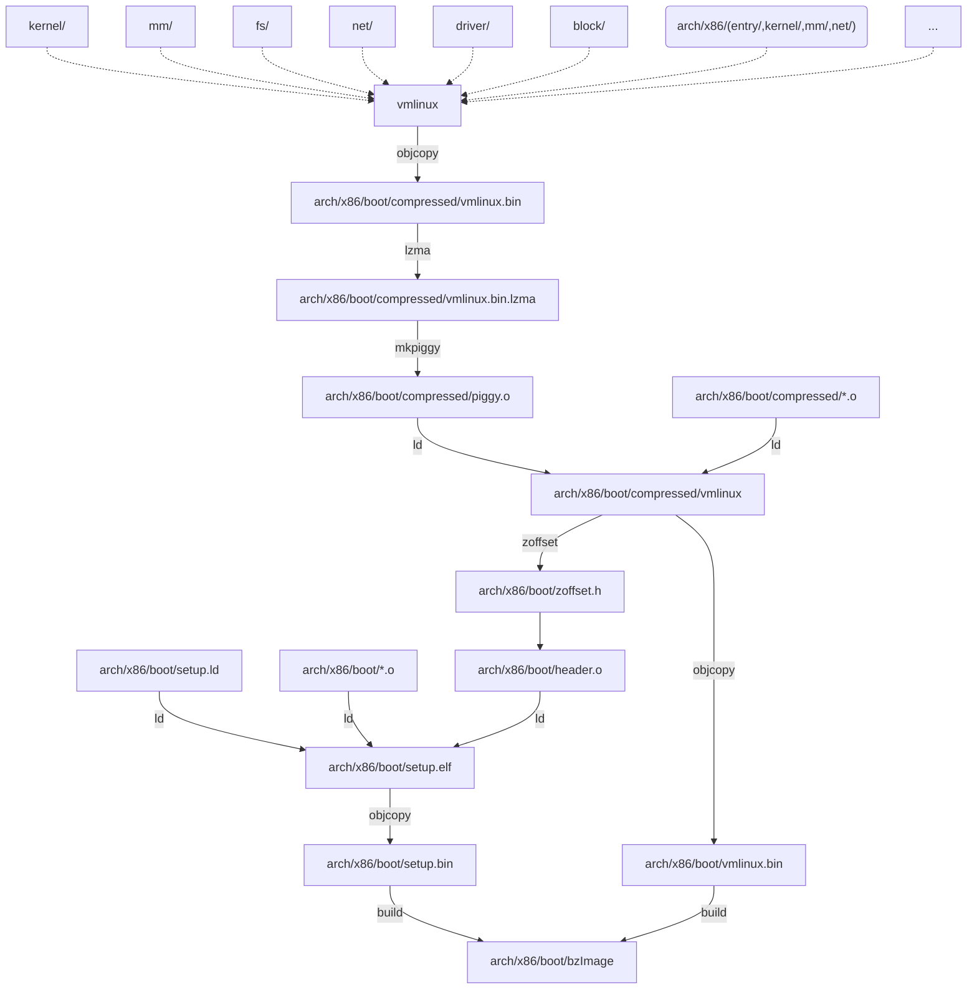

# 内核编译框架

> [](https://duanery.github.io)
> &nbsp;&nbsp;
> ***duanery*** &nbsp;
> 2019年1月23日
>
> Linux爱好者

内核Makefiles文件由5部分组成：

| Makefile                  | the top Makefile.                               |
| ------------------------- | ----------------------------------------------- |
| **.config**               | **the kernel configuration file.**              |
| **arch/$(ARCH)/Makefile** | **the arch Makefile.**                          |
| **scripts/Makefile.***    | **common rules etc. for all kbuild Makefiles.** |
| **kbuild Makefiles**      | **there are about 500 of these.**               |

The top Makefile reads the .config file, which comes from the kernel configuration process.

The top Makefile is responsible for building two major products: vmlinux (the resident kernel image) and modules (any module files). It builds these goals by recursively descending into the subdirectories of the kernel source tree. 

The list of subdirectories which are visited depends upon the kernel configuration. The top Makefile textually includes an arch Makefile with the name arch/$(ARCH)/Makefile. The arch Makefile supplies architecture-specific information to the top Makefile.

Each subdirectory has a kbuild Makefile which carries out the commands passed down from above. The kbuild Makefile uses information from the .config file to construct various file lists used by kbuild to build any built-in or modular targets.

scripts/Makefile.* contains all the definitions/rules etc. that are used to build the kernel based on the kbuild makefiles.

# top Makefile

top Makefile 负责构建vmlinux和模块，依次构建每个核心目录最后链接成vmlinux文件。

## make vmlinux

```makefile
# Objects we will link into vmlinux / subdirs we need to visit
init-y		:= init/
drivers-y	:= drivers/ sound/ firmware/
net-y		:= net/
libs-y		:= lib/
core-y		:= usr/
virt-y		:= virt/
...
# The all: target is the default when no target is given on the
# command line.
# This allow a user to issue only 'make' to build a kernel including modules
# Defaults to vmlinux, but the arch makefile usually adds further targets
all: vmlinux
...
# The arch Makefile can set ARCH_{CPP,A,C}FLAGS to override the default
# values of the respective KBUILD_* variables
ARCH_CPPFLAGS :=
ARCH_AFLAGS :=
ARCH_CFLAGS :=
include arch/$(SRCARCH)/Makefile
```

键入make命令会执行默认的all规则，直接编译vmlinux。

包含arch Makefile。

```makefile
# Final link of vmlinux with optional arch pass after final link
cmd_link-vmlinux =                                                 \
	$(CONFIG_SHELL) $< $(LD) $(LDFLAGS) $(LDFLAGS_vmlinux) ;       \
	$(if $(ARCH_POSTLINK), $(MAKE) -f $(ARCH_POSTLINK) $@, true)

vmlinux: scripts/link-vmlinux.sh vmlinux_prereq $(vmlinux-deps) FORCE
	+$(call if_changed,link-vmlinux)
```

vmlinux通过scripts/link-vmlinux.sh脚本链接。依赖于vmlinux_prereq、$(vmlinux-deps)。

```makefile
core-y		+= kernel/ certs/ mm/ fs/ ipc/ security/ crypto/ block/

vmlinux-dirs	:= $(patsubst %/,%,$(filter %/, $(init-y) $(init-m) \
		     $(core-y) $(core-m) $(drivers-y) $(drivers-m) \
		     $(net-y) $(net-m) $(libs-y) $(libs-m) $(virt-y)))

vmlinux-alldirs	:= $(sort $(vmlinux-dirs) $(patsubst %/,%,$(filter %/, \
		     $(init-) $(core-) $(drivers-) $(net-) $(libs-) $(virt-))))

init-y		:= $(patsubst %/, %/built-in.o, $(init-y))
core-y		:= $(patsubst %/, %/built-in.o, $(core-y))
drivers-y	:= $(patsubst %/, %/built-in.o, $(drivers-y))
net-y		:= $(patsubst %/, %/built-in.o, $(net-y))
libs-y1		:= $(patsubst %/, %/lib.a, $(libs-y))
libs-y2		:= $(patsubst %/, %/built-in.o, $(libs-y))
libs-y		:= $(libs-y1) $(libs-y2)
virt-y		:= $(patsubst %/, %/built-in.o, $(virt-y))

# Externally visible symbols (used by link-vmlinux.sh)
export KBUILD_VMLINUX_INIT := $(head-y) $(init-y)
export KBUILD_VMLINUX_MAIN := $(core-y) $(libs-y) $(drivers-y) $(net-y) $(virt-y)
export KBUILD_LDS          := arch/$(SRCARCH)/kernel/vmlinux.lds
export LDFLAGS_vmlinux
# used by scripts/pacmage/Makefile
export KBUILD_ALLDIRS := $(sort $(filter-out arch/%,$(vmlinux-alldirs)) arch Documentation include samples scripts tools)

vmlinux-deps := $(KBUILD_LDS) $(KBUILD_VMLINUX_INIT) $(KBUILD_VMLINUX_MAIN)
```

vmlinux-deps主要是vmlinux的核心目录组成（init/、net/、kernel/、mm/、fs/、ipc/、block/）。

每个核心目录编译完成后，都会在目录下生成built-in.o文件，最终这些built-in.o文件链接成vmlinux。

```makefile
# The actual objects are generated when descending,
# make sure no implicit rule kicks in
$(sort $(vmlinux-deps)): $(vmlinux-dirs) ;

# Handle descending into subdirectories listed in $(vmlinux-dirs)
# Preset locale variables to speed up the build process. Limit locale
# tweaks to this spot to avoid wrong language settings when running
# make menuconfig etc.
# Error messages still appears in the original language

PHONY += $(vmlinux-dirs)
$(vmlinux-dirs): prepare scripts
	$(Q)$(MAKE) $(build)=$@
```

vmlinux-deps又依赖于vmlinux-dirs，对于每个vmlinux-dirs调用`$(Q)$(MAKE) $(build)=$@`进入该目录下进行编译。参考下文（kbuild Makefile，arch Makefile）

```makefile
# Basic helpers built in scripts/
PHONY += scripts_basic
scripts_basic:
	$(Q)$(MAKE) $(build)=scripts/basic
	$(Q)rm -f .tmp_quiet_recordmcount
...
# Things we need to do before we recursively start building the kernel
# or the modules are listed in "prepare".
# A multi level approach is used. prepareN is processed before prepareN-1.
# archprepare is used in arch Makefiles and when processed asm symlink,
# version.h and scripts_basic is processed / created.
...
prepare2: prepare3 prepare-compiler-check outputmakefile asm-generic

prepare1: prepare2 $(version_h) include/generated/utsrelease.h \
                   include/config/auto.conf
	$(cmd_crmodverdir)

archprepare: archheaders archscripts prepare1 scripts_basic

prepare0: archprepare gcc-plugins
	$(Q)$(MAKE) $(build)=.
# All the preparing..
prepare: prepare0 prepare-objtool
```

在进入每个内核目录进行编译前，需要先准备。

- 准备script/目录下的一些工具
- 准备arch/$(SRCARCH)/中的一些头文件和特定的工具

## make modules

TODO

## make headers_install

这个规则，主要是讲Linux内核头文件是如何安装到/usr/include/linux和/usr/include/asm文件夹下的。

通过命令`make headers_install ARCH=i386 INSTALL_HDR_PATH=/usr`把内核头文件安装到/usr目录下。

```makefile
# ---------------------------------------------------------------------------
# Kernel headers

#Default location for installed headers
export INSTALL_HDR_PATH = $(objtree)/usr

# If we do an all arch process set dst to asm-$(hdr-arch)
hdr-dst = $(if $(KBUILD_HEADERS), dst=include/asm-$(hdr-arch), dst=include/asm)

PHONY += archheaders
archheaders:

PHONY += archscripts
archscripts:

PHONY += __headers
__headers: $(version_h) scripts_basic asm-generic archheaders archscripts
	$(Q)$(MAKE) $(build)=scripts build_unifdef

PHONY += headers_install_all
headers_install_all:
	$(Q)$(CONFIG_SHELL) $(srctree)/scripts/headers.sh install

PHONY += headers_install
headers_install: __headers
	$(if $(wildcard $(srctree)/arch/$(hdr-arch)/include/uapi/asm/Kbuild),, \
	  $(error Headers not exportable for the $(SRCARCH) architecture))
	$(Q)$(MAKE) $(hdr-inst)=include/uapi
	$(Q)$(MAKE) $(hdr-inst)=arch/$(hdr-arch)/include/uapi/asm $(hdr-dst)

PHONY += headers_check_all
headers_check_all: headers_install_all
	$(Q)$(CONFIG_SHELL) $(srctree)/scripts/headers.sh check

PHONY += headers_check
headers_check: headers_install
	$(Q)$(MAKE) $(hdr-inst)=include/uapi HDRCHECK=1
	$(Q)$(MAKE) $(hdr-inst)=arch/$(hdr-arch)/include/uapi/asm $(hdr-dst) HDRCHECK=1
```

```makefile
###
# Shorthand for $(Q)$(MAKE) -f scripts/Makefile.headersinst obj=
# Usage:
# $(Q)$(MAKE) $(hdr-inst)=dir
hdr-inst := -f $(srctree)/scripts/Makefile.headersinst obj
```

主要把include/uapi和arch/$(hdr-arch)/include/uapi/asm下的头文件安装到/usr目录中。

安装任务主要是由`scripts/Makefile.headersinst`这个makefile文件负责，内部主要是递归文件夹的每个目录，对目录中每个头文件都调用`scripts/headers_install.sh`脚本进行安装。

`scripts/Makefile.headersinst`

```makefile
quiet_cmd_install = INSTALL $(printdir) ($(words $(all-files))\
                            file$(if $(word 2, $(all-files)),s))
      cmd_install = \
        $(CONFIG_SHELL) $< $(installdir) $(srcdir) $(input-files1-name); \
        $(CONFIG_SHELL) $< $(installdir) $(oldsrcdir) $(input-files2-name); \
        $(CONFIG_SHELL) $< $(installdir) $(gendir) $(input-files3-name); \
        for F in $(wrapper-files); do                                   \
                echo "\#include <asm-generic/$$F>" > $(installdir)/$$F;    \
        done;                                                           \
        touch $@
$(install-file): scripts/headers_install.sh $(input-files1) $(input-files2) $(input-files3) FORCE
	$(if $(unwanted),$(call cmd,remove),)
	$(if $(wildcard $(dir $@)),,$(shell mkdir -p $(dir $@)))
	$(call if_changed,install)
```

`scripts/headers_install.sh`

```bash
OUTDIR="$1"
shift
SRCDIR="$1"
shift

# Iterate through files listed on command line

FILE=
trap 'rm -f "$OUTDIR/$FILE" "$OUTDIR/$FILE.sed"' EXIT
for i in "$@"
do
	FILE="$(basename "$i")"
	sed -r \
		-e 's/([ \t(])(__user|__force|__iomem)[ \t]/\1/g' \
		-e 's/__attribute_const__([ \t]|$)/\1/g' \
		-e 's@^#include <linux/compiler.h>@@' \
		-e 's/(^|[^a-zA-Z0-9])__packed([^a-zA-Z0-9_]|$)/\1__attribute__((packed))\2/g' \
		-e 's/(^|[ \t(])(inline|asm|volatile)([ \t(]|$)/\1__\2__\3/g' \
		-e 's@#(ifndef|define|endif[ \t]*/[*])[ \t]*_UAPI@#\1 @' \
		"$SRCDIR/$i" > "$OUTDIR/$FILE.sed" || exit 1
	scripts/unifdef -U__KERNEL__ -D__EXPORTED_HEADERS__ "$OUTDIR/$FILE.sed" \
		> "$OUTDIR/$FILE"
	[ $? -gt 1 ] && exit 1
	rm -f "$OUTDIR/$FILE.sed"
done
trap - EXIT
```

headers_install.sh脚本内部主要是把内核头文件中不必要的宏定义去掉。转换成用户空间的头文件。

## make install

TODO

# kbuild Makefile

## kbuild

TODO

## hostprogs

TODO

# arch Makefile

这里只分析x86的arch Makefile，包含在`arch/x86/Makefile`文件中。

## vmlinux

`arch/x86/Makefile`

```makefile
###
# Kernel objects

head-y := arch/x86/kernel/head_$(BITS).o
head-y += arch/x86/kernel/head$(BITS).o
head-y += arch/x86/kernel/ebda.o
head-y += arch/x86/kernel/platform-quirks.o

libs-y  += arch/x86/lib/

# See arch/x86/Kbuild for content of core part of the kernel
core-y += arch/x86/

# drivers-y are linked after core-y
drivers-$(CONFIG_MATH_EMULATION) += arch/x86/math-emu/
drivers-$(CONFIG_PCI)            += arch/x86/pci/
# must be linked after kernel/
drivers-$(CONFIG_OPROFILE) += arch/x86/oprofile/
# suspend and hibernation support
drivers-$(CONFIG_PM) += arch/x86/power/
drivers-$(CONFIG_FB) += arch/x86/video/
drivers-$(CONFIG_RAS) += arch/x86/ras/
```

追加head-y、libs-y、core-y、drivers-y，这些目录最终将连接入vmlinux中。

核心的`core-y += arch/x86/`为什么把arch/x86/整个目录追加给了core-y呢？看注释。

top Makefile在进入arch/x86/目录进行编译时，因为该目录下有Kbuild文件，而不会再读取Makefile文件了。于是会根据Kbuild文件来编译arch/x86/目录。

`arch/x86/Kbuild`

```makefile
obj-y += entry/
obj-$(CONFIG_PERF_EVENTS) += events/
obj-$(CONFIG_KVM) += kvm/
# Xen paravirtualization support
obj-$(CONFIG_XEN) += xen/
# lguest paravirtualization support
obj-$(CONFIG_LGUEST_GUEST) += lguest/
obj-y += realmode/
obj-y += kernel/
obj-y += mm/
obj-y += crypto/
obj-$(CONFIG_IA32_EMULATION) += ia32/
obj-y += platform/
obj-y += net/
obj-$(CONFIG_KEXEC_FILE) += purgatory/
```

可以看到通过Kbuild把arch/x86/中的entry/、kvm/、realmode/、kernel/、mm/、net/目录都编译，最后链接成built-in.o文件，存放在arch/x86/目录下。

## bzImage

`arch/x86/Makefile`

```makefile
####
# boot loader support. Several targets are kept for legacy purposes

boot := arch/x86/boot

BOOT_TARGETS = bzlilo bzdisk fdimage fdimage144 fdimage288 isoimage

PHONY += bzImage $(BOOT_TARGETS)

# Default kernel to build
all: bzImage

# KBUILD_IMAGE specify target image being built
KBUILD_IMAGE := $(boot)/bzImage

bzImage: vmlinux
ifeq ($(CONFIG_X86_DECODER_SELFTEST),y)
	$(Q)$(MAKE) $(build)=arch/x86/tools posttest
endif
	$(Q)$(MAKE) $(build)=$(boot) $(KBUILD_IMAGE)
	$(Q)mkdir -p $(objtree)/arch/$(UTS_MACHINE)/boot
	$(Q)ln -fsn ../../x86/boot/bzImage $(objtree)/arch/$(UTS_MACHINE)/boot/$@

$(BOOT_TARGETS): vmlinux
	$(Q)$(MAKE) $(build)=$(boot) $@
```

默认的规则`all: bzImage`会构建bzImage，bzImage进一步依赖于vmlinux，于是只有在vmlinux构建好了，才会构建x86体系的bzImage，主要用于支持boot loader。

bzImage通过`$(Q)$(MAKE) $(build)=$(boot) $(KBUILD_IMAGE)`这个核心命令来构建。会进入`arch/x86/boot`目录构建`$(boot)/bzImage`。

### boot

`arch/x86/boot/Makefile`

```makefile
hostprogs-y	:= tools/build

quiet_cmd_image = BUILD   $@
silent_redirect_image = >/dev/null
cmd_image = $(obj)/tools/build $(obj)/setup.bin $(obj)/vmlinux.bin \
			       $(obj)/zoffset.h $@ $($(quiet)redirect_image)

$(obj)/bzImage: $(obj)/setup.bin $(obj)/vmlinux.bin $(obj)/tools/build FORCE
	$(call if_changed,image)
	@$(kecho) 'Kernel: $@ is ready' ' (#'`cat .version`')'
```

bzImage依赖于steup.bin、vmlinux.bin、tools/build文件。调用命令`cmd_image`来生成，tools/build是一个host程序，由这个程序把setup.bin、vmlinux.bin文件链接成一个bzImage文件。

#### setup.bin

`arch/x86/boot/Makefile`

```makefile
setup-y		+= a20.o bioscall.o cmdline.o copy.o cpu.o cpuflags.o cpucheck.o
setup-y		+= early_serial_console.o edd.o header.o main.o memory.o
setup-y		+= pm.o pmjump.o printf.o regs.o string.o tty.o video.o
setup-y		+= video-mode.o version.o
setup-$(CONFIG_X86_APM_BOOT) += apm.o

SETUP_OBJS = $(addprefix $(obj)/,$(setup-y))

sed-zoffset := -e 's/^\([0-9a-fA-F]*\) [ABCDGRSTVW] \(startup_32\|startup_64\|efi32_stub_entry\|efi64_stub_entry\|efi_pe_entry\|input_data\|_end\|_ehead\|_text\|z_.*\)$$/\#define ZO_\2 0x\1/p'

quiet_cmd_zoffset = ZOFFSET $@
      cmd_zoffset = $(NM) $< | sed -n $(sed-zoffset) > $@

targets += zoffset.h
$(obj)/zoffset.h: $(obj)/compressed/vmlinux FORCE
	$(call if_changed,zoffset)

AFLAGS_header.o += -I$(objtree)/$(obj)
$(obj)/header.o: $(obj)/zoffset.h

LDFLAGS_setup.elf	:= -T
$(obj)/setup.elf: $(src)/setup.ld $(SETUP_OBJS) FORCE
	$(call if_changed,ld)

OBJCOPYFLAGS_setup.bin	:= -O binary
$(obj)/setup.bin: $(obj)/setup.elf FORCE
	$(call if_changed,objcopy)

$(obj)/compressed/vmlinux: FORCE
	$(Q)$(MAKE) $(build)=$(obj)/compressed $@
```

setup.bin文件依赖于setup.elf，又依赖于SETUP_OBJS，主要由arch/x86/boot/目录下的源码文件组成。这些源文件中的header.o文件又依赖于zoffset.h，又依赖于$(obj)/compressed/vmlinux文件。于是还需要到arch/x86/boot/compressed目录下编译vmlinux文件。

#### vmlinux.bin

`arch/x86/boot/Makefile`

```makefile
OBJCOPYFLAGS_vmlinux.bin := -O binary -R .note -R .comment -S
$(obj)/vmlinux.bin: $(obj)/compressed/vmlinux FORCE
	$(call if_changed,objcopy)
```

vmlinux.bin文件也依赖于$(obj)/compressed/vmlinux文件。也需要到arch/x86/boot/compressed目录下编译vmlinux文件。

#### compressed/vmlinux

`arch/x86/boot/compressed/Makefile`

```makefile
vmlinux-objs-y := $(obj)/vmlinux.lds $(obj)/head_$(BITS).o $(obj)/misc.o \
	$(obj)/string.o $(obj)/cmdline.o $(obj)/error.o \
	$(obj)/piggy.o $(obj)/cpuflags.o

vmlinux-objs-$(CONFIG_EARLY_PRINTK) += $(obj)/early_serial_console.o
vmlinux-objs-$(CONFIG_RANDOMIZE_BASE) += $(obj)/kaslr.o
ifdef CONFIG_X86_64
	vmlinux-objs-$(CONFIG_RANDOMIZE_BASE) += $(obj)/pagetable.o
endif
vmlinux-objs-$(CONFIG_EFI_STUB) += $(obj)/eboot.o $(obj)/efi_stub_$(BITS).o \
	$(objtree)/drivers/firmware/efi/libstub/lib.a
vmlinux-objs-$(CONFIG_EFI_MIXED) += $(obj)/efi_thunk_$(BITS).o

$(obj)/vmlinux: $(vmlinux-objs-y) FORCE
	$(call if_changed,check_data_rel)
	$(call if_changed,ld)
```

compressed/vmlinux的编译依赖于arch/x86/boot/compressed/目录下的大部分源文件，但其中的核心是piggy.o文件。

```makefile
hostprogs-y	:= mkpiggy

OBJCOPYFLAGS_vmlinux.bin :=  -R .comment -S
$(obj)/vmlinux.bin: vmlinux FORCE
	$(call if_changed,objcopy)
	
vmlinux.bin.all-y := $(obj)/vmlinux.bin
cmd_lzma = (cat $(filter-out FORCE,$^) | \
	lzma -9 && $(call size_append, $(filter-out FORCE,$^))) > $@ || \
	(rm -f $@ ; false)
$(obj)/vmlinux.bin.lzma: $(vmlinux.bin.all-y) FORCE
	$(call if_changed,lzma)
suffix-$(CONFIG_KERNEL_LZMA)	:= lzma

quiet_cmd_mkpiggy = MKPIGGY $@
      cmd_mkpiggy = $(obj)/mkpiggy $< > $@ || ( rm -f $@ ; false )
$(obj)/piggy.S: $(obj)/vmlinux.bin.$(suffix-y) $(obj)/mkpiggy FORCE
	$(call if_changed,mkpiggy)
```

piggy.o文件依赖于piggy.S文件，又依赖于$(obj)/vmlinux.bin.$(suffix-y)文件，又依赖于$(vmlinux.bin.all-y)，也就是$(obj)/vmlinux.bin，又依赖于vmlinux。

top Makefile编译完生成的vmlinux文件会在这里先objcopy成vmlinux.bin文件，然后再由lzma压缩成vmlinux.bin.lzma，最后再由mkpiggy程序编译成piggy.S文件，最后链接入compressed/vmlinux.

整个构建流程图：




## 参考文档

### 内核文档

Documentation/kbuild/*

